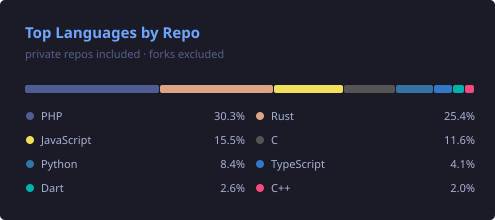

<!-- 히어로 배너 -->

<!-- About Me -->
## 👋 About

Software Engineer building **platform & infrastructure** tools.

Currently focused on **AI-native developer tooling** in Rust — MCP servers, agent orchestration, and knowledge systems.

Commerce · Regulated Fintech · Crypto · Security on AWS/GCP

Based in **Seoul**.

## 🧩 Agent Skills

Personal agent skill collection for AI coding agents — problem discovery, cognitive self-analysis, corrective routines, and OSS distribution readiness.

→ **Full catalog & install guide:** [skills/README.md](skills/README.md)

<!-- 현재 작업 중인 것 -->

## 🚀 Featured

<table>
<tr>
<td width="25%" valign="top">

### [research-agent](https://github.com/epicsagas/research-agent)
`Rust`

Research memory for AI agents. arXiv/OpenAlex papers → SQLite with full-text search, LLM gap analysis, survey reports. Rust CLI + 18-tool MCP server; ships as a 5-host plugin.

  

</td>
<td width="25%" valign="top">

### [epic-harness](https://github.com/epicsagas/epic-harness)
`Rust`

Multi-tool AI agent harness — 22 skills, self-evolving engine, unified memory, autonomous spec-to-PR pipeline. Works with Claude Code, Codex, Cursor, OpenCode, and Cline.

  

</td>
<td width="25%" valign="top">

### [alcove](https://github.com/epicsagas/alcove)
`Rust`

MCP doc server for AI agents — BM25 + vector hybrid search over private project docs, tree-sitter code indexing, policy enforcement for doc consistency.

  

</td>
<td width="25%" valign="top">

### [Velith](https://github.com/epicsagas/Velith)
`Plugin`

AI-native publishing system — build books like software. 6-phase pipeline from blank page to EPUB/PDF, with 16 skills, 7 agents, and 8 genre templates.

 

</td>
</tr>
</table>

## 🌐 Research Hubs

<table>
<tr>
<td width="25%" valign="top">

**[The Ontology Lineage](https://epicsagas.github.io/ontology-explorer/en/)**

2,300 years of ontology research, 425 papers, one static page.

`English · 한국어`

</td>
<td width="25%" valign="top">

**[The Uncanny Valley of AI Writing](https://epicsagas.github.io/uncanny-writing/)**

Fact-checked dossier on reader aversion to AI text — 86 papers, 4 open gaps.

`한국어 · English`

</td>
<td width="25%" valign="top">

**[epicsagas.github.io](https://epicsagas.github.io/)**

Hub page linking every published research site and the tooling behind them.

`English`

</td>
<td width="25%" valign="top">

**[Claude Code plugins](https://github.com/epicsagas/plugins)**

Plugin marketplace — discover and install skills, commands, and agent configurations.

`GitHub`

</td>
</tr>
</table>

## 🧰 More Tools

- **[llm-kernel](https://github.com/epicsagas/llm-kernel)** — Rust foundation library for AI-native apps: 16-provider catalog, LLM client, MCP server, ONNX embeddings
- **[opencodex](https://github.com/epicsagas/opencodex)** — Universal provider proxy for OpenAI Codex & Claude Code — any LLM behind one CLI
- **[claudy](https://github.com/epicsagas/claudy)** — Multi-provider AI launcher (Anthropic, Gemini, OpenRouter, Ollama)
- **[Episteme](https://github.com/epicsagas/Episteme)** — Software engineering knowledge graph: patterns, laws, refactorings, smells
- **[llm-transpile](https://github.com/epicsagas/llm-transpile)** — Raw docs → structured bridge format with adaptive token compression
- **[obsidian-forge](https://github.com/epicsagas/obsidian-forge)** — Obsidian vault generator, automation daemon, graph strengthener
- **[homebrew-tap](https://github.com/epicsagas/homebrew-tap)** — Homebrew tap for the CLI tools above

<!-- GitHub 통계 -->
## 📊 GitHub Stats

<picture>
  <source media="(prefers-color-scheme: dark)" srcset="https://github-profile-summary-cards.vercel.app/api/cards/stats?username=epicsagas&theme=tokyonight">
  <source media="(prefers-color-scheme: light)" srcset="https://github-profile-summary-cards.vercel.app/api/cards/stats?username=epicsagas&theme=github">
  
</picture>

<!-- 주 사용 언어 (private 포함, GitHub Actions 생성) -->

<!-- OpenSSF Criticality Score top 5 (GitHub Actions, weekly) -->
**🛡️ OSS Criticality Top 5** → [Full ranking](./criticality/README.md)

<!-- 연속 기여 -->
<picture>
  <source media="(prefers-color-scheme: dark)" srcset="https://streak-stats.demolab.com/?user=epicsagas&theme=tokyonight&hide_border=true&background=00000000&ring=C9462B&fire=E8533F&currStreakLabel=C9462B">
  <source media="(prefers-color-scheme: light)" srcset="https://streak-stats.demolab.com/?user=epicsagas&theme=default&hide_border=true">
  
</picture>

<!-- 트로피 -->
## 🏆 Achievements

<!-- 활동 그래프 -->
## 📈 Activity

<!-- 연락처 / 링크 -->
## 🔗 Links

<!-- 푸터 배너 -->

